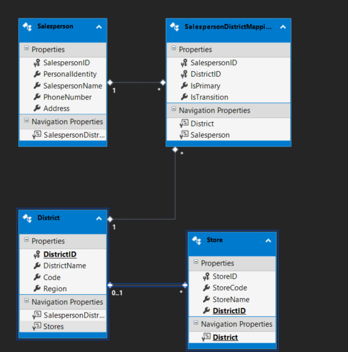

# Sales Management Application.
page_type: sample
languages:
- csharp  
products:
- WPF
- Web API  
- dotnet
- Sql
description: "Sample application for sales management"

# WPF application 

-- project name : folder SalesDashBoard --> SalesExplorer.Dashboard
It has a sales management UI built on .NET 8, following the MVVM architecture pattern. For all the operations, it utilizes Web API in the infrastructure project.

Communication : Web api
Logging : Utilizing Serilog for structured logging.
Testing : Unit and integration test using xunit.

# Web Api
-- project name : folder web api --> SalesManagement.WebApi
It is built on .NET Web API and encapsulates all database operations, exposing REST methods for database communication.

DataBase : sql
Communication: Utilizing Dapper and Repository pattern.
Logging : Utilizing Serilog for structured logging.
Testing : integration test using xunit.
Exception : Handling through global exception handling.
Key functionality : Api versioning, ratelimit,

# Database 
I am utilizing a local SQL database for all the database-related options. It includes tables and stored procedures.
